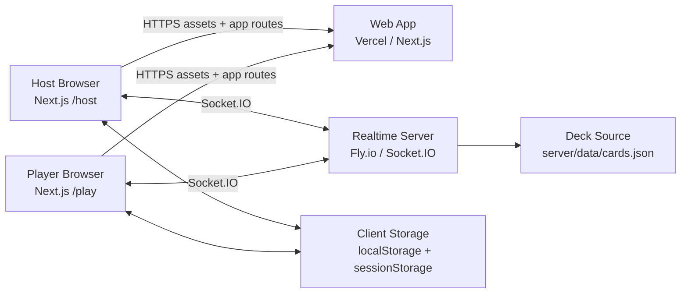

# Backtrack Architecture Overview

## Purpose
This document explains the current MVP architecture, ownership boundaries, and runtime responsibilities.

## System Components

## Authority Model
- Server is authoritative for room state, turn order, placement validation, pause/resume, timing, and termination.
- Clients send intents (`room.join`, `turn.place`, `turn.reveal`, etc.) and render server events.
- Room state is in-memory on the realtime server process; there is no durable room-state backend in MVP.

## Directory Ownership
- `/Users/braydenreimann/Programming/repos/bt-mvp/app`: UI routes and components only.
- `/Users/braydenreimann/Programming/repos/bt-mvp/lib`: shared client/server types, storage helpers, socket URL helpers, mock fixtures.
- `/Users/braydenreimann/Programming/repos/bt-mvp/server`: authoritative realtime logic and socket handlers.

## Runtime Responsibilities

### Web app (Next.js)
- Serves host/player experiences.
- Maintains client session tokens in browser storage.
- Connects to realtime server via `NEXT_PUBLIC_SOCKET_URL` or hostname fallback.

### Realtime server (Socket.IO)
- Creates rooms and sessions.
- Enforces room lifecycle and phase transitions.
- Emits canonical `room.snapshot` and turn/game events.
- Handles pause/resume/terminate and reconnection flows.

## Current MVP Decisions
- In-game kicking is intentional and must be supported after game start.
- Single-player start is intentional (`>= 1` players).
- Deployment target is split hosting: web on Vercel, realtime server on Fly.io.

## Known Architectural Constraints
- One authoritative process is assumed; horizontal scaling would split in-memory room state.
- Deck loading currently depends on repo-relative pathing from server runtime.
- CORS is currently permissive and should be tightened for closed beta domains.
