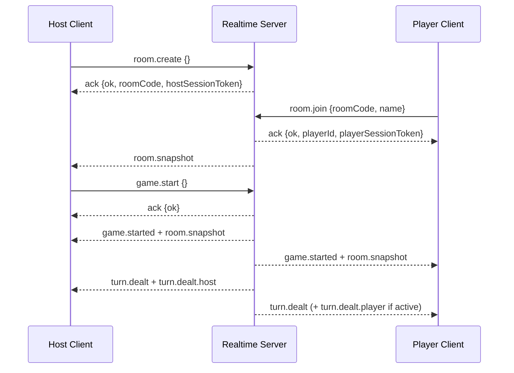
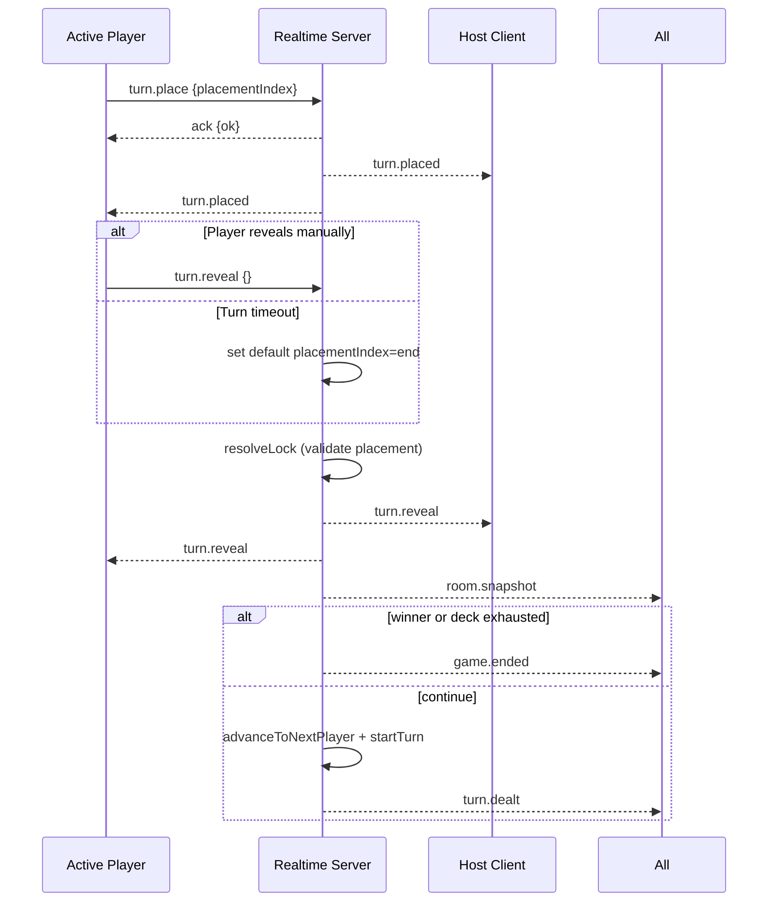
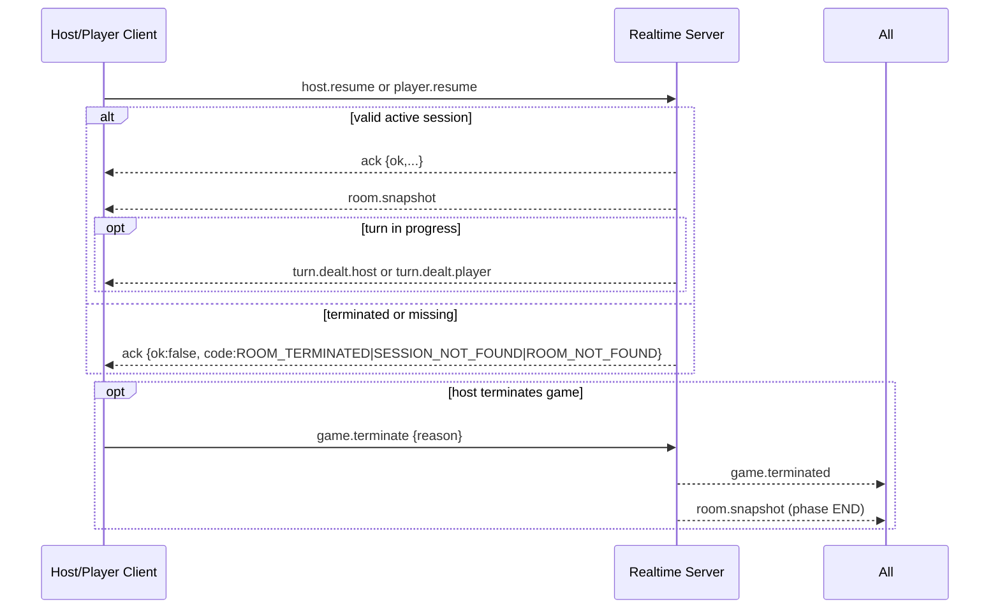
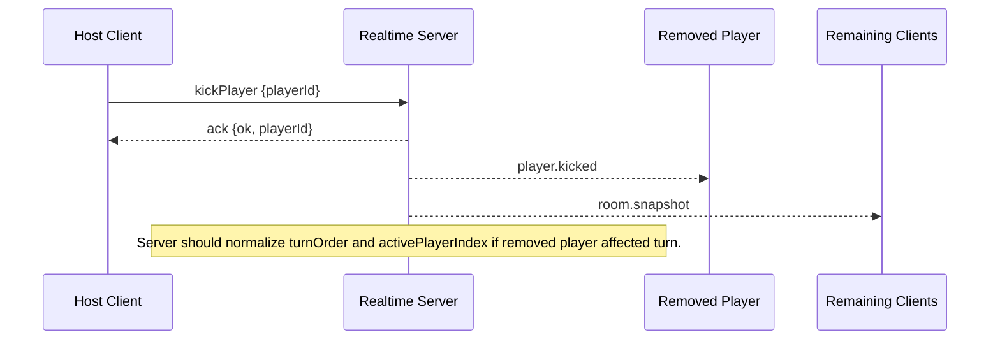

# Critical Flow Diagrams

## 1) Create, Join, and Start

```mermaid
sequenceDiagram
  participant Host as Host Client
  participant Server as Realtime Server
  participant Player as Player Client

  Host->>Server: room.create {}
  Server-->>Host: ack {ok, roomCode, hostSessionToken}

  Player->>Server: room.join {roomCode, name}
  Server-->>Player: ack {ok, playerId, playerSessionToken}
  Server-->>Host: room.snapshot

  Host->>Server: game.start {}
  Server-->>Host: ack {ok}
  Server-->>Host: game.started + room.snapshot
  Server-->>Player: game.started + room.snapshot
  Server-->>Host: turn.dealt + turn.dealt.host
  Server-->>Player: turn.dealt (+ turn.dealt.player if active)
```

## 2) Active Turn: Place and Reveal

```mermaid
sequenceDiagram
  participant Player as Active Player
  participant Server as Realtime Server
  participant Host as Host Client

  Player->>Server: turn.place {placementIndex}
  Server-->>Player: ack {ok}
  Server-->>Host: turn.placed
  Server-->>Player: turn.placed

  alt Player reveals manually
    Player->>Server: turn.reveal {}
  else Turn timeout
    Server->>Server: set default placementIndex=end
  end

  Server->>Server: resolveLock (validate placement)
  Server-->>Host: turn.reveal
  Server-->>Player: turn.reveal
  Server-->>All: room.snapshot

  alt winner or deck exhausted
    Server-->>All: game.ended
  else continue
    Server->>Server: advanceToNextPlayer + startTurn
    Server-->>All: turn.dealt
  end
```

## 3) Reconnect and Room Termination

```mermaid
sequenceDiagram
  participant Client as Host/Player Client
  participant Server as Realtime Server

  Client->>Server: host.resume or player.resume
  alt valid active session
    Server-->>Client: ack {ok,...}
    Server-->>Client: room.snapshot
    opt turn in progress
      Server-->>Client: turn.dealt.host or turn.dealt.player
    end
  else terminated or missing
    Server-->>Client: ack {ok:false, code:ROOM_TERMINATED|SESSION_NOT_FOUND|ROOM_NOT_FOUND}
  end

  opt host terminates game
    Client->>Server: game.terminate {reason}
    Server-->>All: game.terminated
    Server-->>All: room.snapshot (phase END)
  end
```

## 4) In-Game Kick (Intentional MVP Path)

```mermaid
sequenceDiagram
  participant Host as Host Client
  participant Server as Realtime Server
  participant Player as Removed Player
  participant Others as Remaining Clients

  Host->>Server: kickPlayer {playerId}
  Server-->>Host: ack {ok, playerId}
  Server-->>Player: player.kicked
  Server-->>Others: room.snapshot

  Note over Server: Server should normalize turnOrder and activePlayerIndex if removed player affected turn.
```
