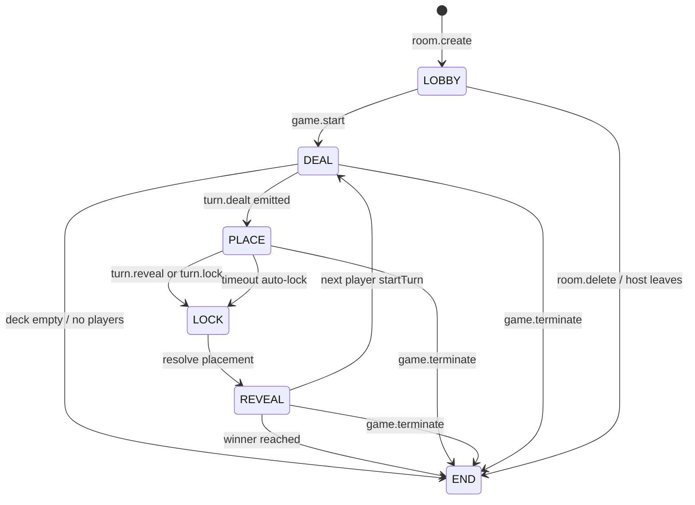

# Room State Machine

## Purpose
This document describes room/turn phase transitions and invariants for the authoritative server.

## Phases
- `LOBBY`
- `DEAL`
- `PLACE`
- `LOCK`
- `REVEAL`
- `END`

## Transition Diagram

## Core Invariants
- Server is authoritative for phase, timers, active player, and scoring.
- `turn.place`, `turn.remove`, and `turn.reveal` are only accepted in `PLACE`.
- Pause halts active timers and preserves remaining time in `paused*RemainingMs`.
- Resume restores timers from paused remaining values.
- `room.snapshot.seq` increases on state changes to support ordered client reconciliation.

## Timer Model
- Turn timer starts when entering `PLACE`.
- If timer expires without placement, server defaults placement to end of active timeline and resolves lock as `TIMEOUT`.
- Reveal timer delays next turn start.

## Session/Lifecycle Rules
- Host can terminate game from non-ended states.
- Players cannot leave after game starts (`room.leave` locked to lobby).
- Kicking is currently permitted during/after start and must maintain coherent active-turn state.
- Host disconnect marks host disconnected but does not currently GC room automatically.

## MVP Decisions Baked Into Logic
- Single-player starts are intentional.
- In-game kicking is intentional and should be treated as first-class behavior.
